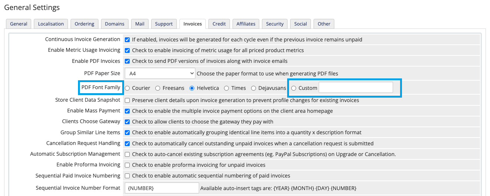

[](#) [](#) [](#)

## تبدیل فونت به فرمت `ctg.z - php - z` در کتابخانه [tcpdf](https://tcpdf.org/)

به منظور سهولت در شخصی سازی فونت فاکتور های PDF در [WHMCS](https://www.whmcs.com/) برای صاحبان هاستینگ و توسعه دهندگان

```sh
npm run dev
php artisan serve
```

## امکانات

- **پیشنمایش فونت**: نمایش فونت آپلود شده قبل از تبدیل
- **آپلود چندین فونت**: تبدیل همزمان چندین فونت
- **تاریخچه تبدیل‌ها**: نمایش فونت‌های تبدیل شده اخیر با گزینه دانلود مجدد
- **حذف خودکار**: حذف خودکار فونت‌ها بعد از 48 ساعت
- **گوگل فونت**: جستجو و تبدیل در میان هزاران فونت در [Google Fonts](https://fonts.google.com/)
- **جلوگیری از استفاده بیش از حد** با [throttle middleware](https://laravel.com/docs/13.x/rate-limiting)

## نحوه استفاده در WHMCS

- فونت `ttf` خو را آپلود کنید، ابزار آن را تبدیل و `3` فایل خروجی میدهد: `font.ct.z`, `font.z`, `font.php`
- 3 فایل را در مسیر `whmcs_dir/vendor/tecnickcom/tcpdf/fonts` آپلود کنید.
- وارد داشبورد WHMCS شوید و به مسیر **پیکربندی > تنظیمات عمومی > فاکتورها** بروید.
- فونت PDF را روی **Custom** بزارید و نام آن را فونتی که خروجی گرفتید.


